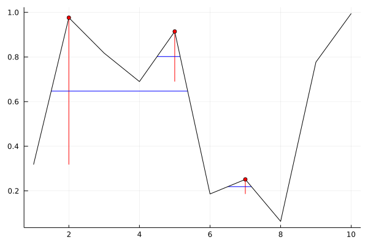

# FindPeaks

[Julia](https://julialang.org/) package for peak detection inspired by [MATLAB's findpeaks](https://www.mathworks.com/help/signal/ref/findpeaks.html) function.

## Installation

The package can be installed by running
```julia
import Pkg
Pkg.add(url="https://github.com/vkumpost/FindPeaks")
```

To make sure everything is ready to go we can run package tests
```julia
Pkg.test("FindPeaks")
```

## Example
```julia
using FindPeaks
using Plots
    
data = rand(10)
pr = findpeaks(data)
plot(pr, data)
```


## Usage

Function `findpeaks` can be called on vector `data`. Optionally, also location vector `x` can be specified, which ensures that the found peak locations and widths are in the correct units.
```julia
pr = findpeaks(data; kwargs...)
pr = findpeaks(data, x; kwargs...)
```
The currently supported keyword arguments are
- `npeaks`: Maximum number of peaks to return.
- `sortstr`: Sort peaks. Possible options are `"ascend"` (the smallest peak first) or `"descend"` (the largest peak first).
- `sortref`: Reference property used to sort the peaks. Possible options are `"height"` (default) and `"prominence"`. This option is ignored if `sortstr` is not specified.
- `minheight`: Minimum peak height.
- `minprominence`: Minimum peak prominence.
- `threshold`: Minimum height difference between a peak and the neighboring points.
- `mindistance`: Minimum distance between neighboring peaks.
- `widthreference`: `"halfheight"` will use half heights, instead of half prominences, as reference heights to calculate the peak widths.
- `minwidth`: Minimum peak width.
- `maxwidth`: Maximum peak width.

## Output Handling
The found peak heights, locations, prominences, and widths can be extracted by corresponding functions
```julia
peaks = peakheights(pr)
locations = peaklocations(pr)
prominences = peakprominences(pr)
widths = peakwidths(pr)
```
The package also implements a plot recipe for a quick visual inspection of the results.
